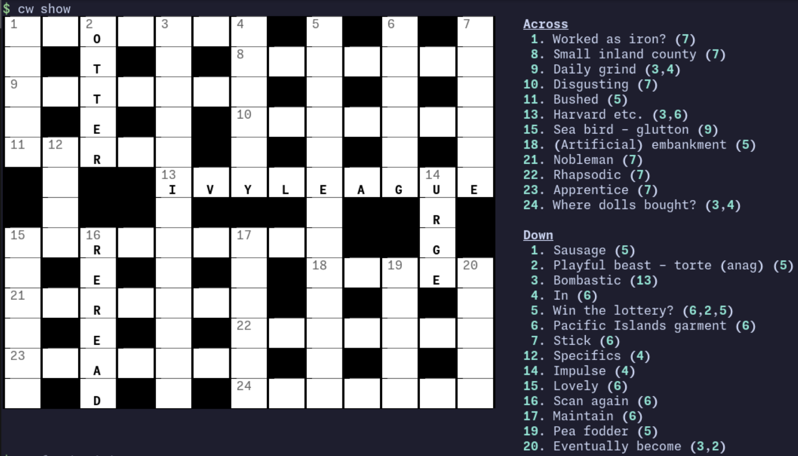
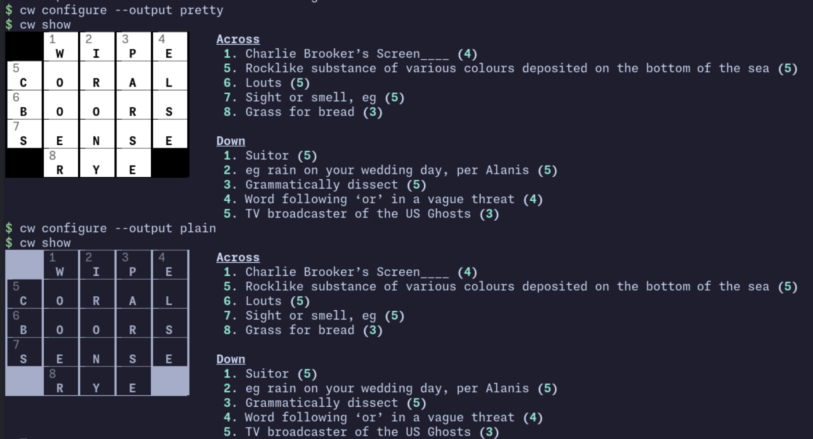

# cw



`cw` fetches and solves [the Guardian](https://www.theguardian.com) crosswords in the terminal.
I made this because I enjoy the Guardian crosswords and wanted a way to do them without leaving my terminal during the day.

I must say a huge thank you to the Guardian for making their crosswords freely available on their website.
Please consider [donating](https://support.theguardian.com/int/contribute).

## Installation

Install `cw` with [`uv`](https://docs.astral.sh/uv/).

```bash
# Install latest from main branch
uv tool install "git+https://github.com/emilioziniades/cw.git@main"

# Install a specific release tag
uv tool install "git+https://github.com/emilioziniades/cw.git@0.1.2"
```

## Usage

```bash
# Fetch today's crosswords
cw fetch mini
cw fetch quick
cw fetch cryptic

# Start today's mini crossword
cw start mini
# Start a specific crossword
cw start quick 17582

# View the current crossword
cw show

# Solve clues
cw solve 1a hannibal
cw solve 12d ptolemy

# Clear all the clues
cw clear

# Check if the crossword is complete
cw check

# Reveal incorrect letters
cw check --reveal
```

## Configuration

`cw` has two output styles: `pretty` and `plain`. `pretty` is the default.

```bash
cw configure --output pretty
cw configure --output plain
```



## LLM Usage Disclaimer

I actually did not use an LLM to write this project.
I tried to use LLMs as little as possible to create this tool.
Whilst I did use LLMs in a chat interface as a sort of Google replacement, I intentionally did not use a terminal coding agent like Codex.
One of the motivations for this project was to create something by hand.
I find this style of programming much more fun and engaging, and whilst my work requires me to use LLMs more and more for programming, I will continue writing code "by hand" in personal side projects like this.
